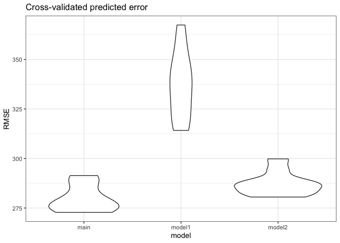

Homework 6
================
Nikhita Damaraju

This is my solution to Homework 6.

Library imports

``` r
library(tidyverse)
library(dplyr)
library(stringr)
library(ggplot2)
library(modelr)


theme_set(theme_bw() + theme(legend.position = "bottom"))
options(
  ggplot2.continuous.colour = "viridis",
  ggplot2.continuous.fill = "viridis"
)
scale_colour_discrete = scale_color_viridis_d
scale_fill_discrete = scale_fill_viridis_d

# setting seed value
set.seed(1)
```

## Problem 1

Reading data and adding victim age variable ß

``` r
homicide_df = 
  read_csv("./datasets/homicide-data.csv", na = c("", "NA", "Unknown")) %>% 
  mutate(
    city_state = str_c(city, state, sep = ", "),
    victim_age = as.numeric(victim_age),
    resolution = case_when(
      disposition == "Closed without arrest" ~ 0,
      disposition == "Open/No arrest"        ~ 0,
      disposition == "Closed by arrest"      ~ 1)
  ) %>% 
  filter(
    victim_race %in% c("White", "Black"),
    city_state != "Tulsa, AL") %>%   # removing tulsa AL
  select(city_state, resolution, victim_age, victim_race, victim_sex)
```

### Logistic regression output for Baltimore

``` r
baltimore_df =
  homicide_df %>% 
  filter(city_state == "Baltimore, MD")
glm(resolution ~ victim_age + victim_race + victim_sex, 
    data = baltimore_df,
    family = binomial()) %>% 
  broom::tidy() %>% 
  mutate(
    OR = exp(estimate),
    CI_lower = exp(estimate - 1.96 * std.error),
    CI_upper = exp(estimate + 1.96 * std.error)
  ) %>% 
  select(term, OR, starts_with("CI")) %>% 
  knitr::kable(digits = 3)
```

| term              |    OR | CI\_lower | CI\_upper |
| :---------------- | ----: | --------: | --------: |
| (Intercept)       | 1.363 |     0.975 |     1.907 |
| victim\_age       | 0.993 |     0.987 |     1.000 |
| victim\_raceWhite | 2.320 |     1.648 |     3.268 |
| victim\_sexMale   | 0.426 |     0.325 |     0.558 |

## Problem 2

**Loading and cleaning dataset**

``` r
weight_df = 
  read_csv('./datasets/birthweight.csv') %>%
  mutate(
    babysex = as.factor(case_when(
      babysex == 1 ~ 'male',
      babysex == 2 ~ 'female'
    )),
    
    frace = as.factor(case_when(
      frace == 1 ~ 'White',
      frace == 2 ~ 'Black',
      frace == 3 ~ 'Asian',
      frace == 4 ~ 'Puerto Rican',
      frace == 8 ~ 'Other',
      frace == 9 ~ 'Unknown')),
    
    mrace = as.factor(case_when(
      mrace == 1 ~ 'White',
      mrace == 2 ~ 'Black',
      mrace == 3 ~ 'Asian',
      mrace == 4 ~ 'Puerto Rican',
      mrace == 8 ~ 'Other',
      mrace == 9 ~ 'Unknown')),
    
    malform = as.factor(case_when(
      malform == 0 ~ 'absent',
      malform == 1 ~ 'present'
    ))
  ) %>%
  drop_na()
```

The dataset consisting of weights of children has 20 variables out of
which, 4 variables - `babysex`, `frace`, `mrace` and `malform` are
categorical. There are no missing values in the dataset and it consists
of 4342 rows.

### Linear model

**Identifying predictors of interest**

For categorical variables, based on previous studies, there is an
indication that ethnicity can influence the weight of the baby. For
numerical variables, we look at the correlation with the outcome to
identify variables that are independent correlating with the outcome. We
also omit variables `pnulbw` and `pnumsga` due to large number of values
with 0.

``` r
# Selecting numerical variables 
weight_df %>%
  select(-c(babysex, frace, mrace, malform, pnumlbw, pnumsga)) %>%
  cor() %>% round(digits = 2) %>% knitr::kable()
```

|          |  bhead | blength |    bwt |  delwt | fincome | gaweeks | menarche | mheight | momage | parity |  ppbmi |   ppwt | smoken | wtgain |
| :------- | -----: | ------: | -----: | -----: | ------: | ------: | -------: | ------: | -----: | -----: | -----: | -----: | -----: | -----: |
| bhead    |   1.00 |    0.63 |   0.75 |   0.21 |    0.12 |    0.38 |     0.00 |    0.12 |   0.11 | \-0.02 |   0.09 |   0.14 | \-0.05 |   0.18 |
| blength  |   0.63 |    1.00 |   0.74 |   0.23 |    0.08 |    0.36 |   \-0.02 |    0.16 |   0.08 | \-0.03 |   0.07 |   0.15 | \-0.07 |   0.19 |
| bwt      |   0.75 |    0.74 |   1.00 |   0.29 |    0.15 |    0.41 |   \-0.02 |    0.19 |   0.14 | \-0.01 |   0.09 |   0.18 | \-0.08 |   0.25 |
| delwt    |   0.21 |    0.23 |   0.29 |   1.00 |    0.03 |    0.12 |   \-0.09 |    0.41 |   0.07 |   0.00 |   0.72 |   0.87 |   0.05 |   0.42 |
| fincome  |   0.12 |    0.08 |   0.15 |   0.03 |    1.00 |    0.11 |     0.00 |    0.13 |   0.32 | \-0.03 | \-0.02 |   0.05 |   0.08 | \-0.02 |
| gaweeks  |   0.38 |    0.36 |   0.41 |   0.12 |    0.11 |    1.00 |     0.00 |    0.06 |   0.11 | \-0.08 |   0.03 |   0.06 |   0.04 |   0.15 |
| menarche |   0.00 |  \-0.02 | \-0.02 | \-0.09 |    0.00 |    0.00 |     1.00 |    0.07 |   0.18 |   0.02 | \-0.12 | \-0.07 |   0.02 | \-0.04 |
| mheight  |   0.12 |    0.16 |   0.19 |   0.41 |    0.13 |    0.06 |     0.07 |    1.00 |   0.11 | \-0.01 | \-0.10 |   0.43 |   0.06 |   0.05 |
| momage   |   0.11 |    0.08 |   0.14 |   0.07 |    0.32 |    0.11 |     0.18 |    0.11 |   1.00 |   0.05 |   0.08 |   0.13 |   0.08 | \-0.09 |
| parity   | \-0.02 |  \-0.03 | \-0.01 |   0.00 |  \-0.03 |  \-0.08 |     0.02 |  \-0.01 |   0.05 |   1.00 | \-0.01 | \-0.01 | \-0.01 |   0.01 |
| ppbmi    |   0.09 |    0.07 |   0.09 |   0.72 |  \-0.02 |    0.03 |   \-0.12 |  \-0.10 |   0.08 | \-0.01 |   1.00 |   0.85 |   0.01 | \-0.11 |
| ppwt     |   0.14 |    0.15 |   0.18 |   0.87 |    0.05 |    0.06 |   \-0.07 |    0.43 |   0.13 | \-0.01 |   0.85 |   1.00 |   0.04 | \-0.07 |
| smoken   | \-0.05 |  \-0.07 | \-0.08 |   0.05 |    0.08 |    0.04 |     0.02 |    0.06 |   0.08 | \-0.01 |   0.01 |   0.04 |   1.00 |   0.03 |
| wtgain   |   0.18 |    0.19 |   0.25 |   0.42 |  \-0.02 |    0.15 |   \-0.04 |    0.05 | \-0.09 |   0.01 | \-0.11 | \-0.07 |   0.03 |   1.00 |

Based on the results above, we pick our predictors as - bhead, blength,
gaweeks, wtgain, babysex and the categorical variable - mrace

**Linear model**

``` r
main_model = lm(bwt ~ bhead + blength + gaweeks + wtgain + mrace, data = weight_df)
```

**Model residuals against fitted values**

``` r
weight_df %>%
  modelr::add_residuals(main_model) %>% 
  modelr::add_predictions(main_model) %>%
  ggplot(aes(x = pred, y = resid)) +
  geom_point() +
  labs(x = 'Fitted values', y = 'Residuals', title = 'Residuals vs Fitted values')
```

<!-- -->

### Comparison of model with other models

``` r
model1 = lm(bwt ~ blength + gaweeks, data = weight_df)
model2 = lm(bwt ~ bhead*blength*babysex, data = weight_df)

cv_df =
  crossv_mc(weight_df, 10) %>% 
  mutate(
    train = map(train, as_tibble),
    test = map(test, as_tibble))

cv_df = 
  cv_df %>%
  mutate(
    main_model  = map(train, ~lm(bwt ~ bhead + blength + gaweeks + wtgain + mrace, data = .x)),
    model1 = map(train, ~lm(bwt ~ blength + gaweeks, data = .x)),
    model2 = map(train, ~lm(bwt ~ bhead*blength*babysex, data = weight_df))) %>%
  mutate(
    rmse_main = map2_dbl(main_model, test, ~rmse(model = .x, data = .y)),
    rmse_model1 = map2_dbl(model1, test, ~rmse(model = .x, data = .y)),
    rmse_model2 = map2_dbl(model2, test, ~rmse(model = .x, data = .y)))
```

**Cross-validated predicted error vs model of choice**

``` r
cv_df %>% 
  select(starts_with("rmse")) %>% 
  pivot_longer(
    everything(),
    names_to = "model", 
    values_to = "rmse",
    names_prefix = "rmse_") %>% 
  mutate(model = fct_inorder(model)) %>% 
  ggplot(aes(x = model, y = rmse)) + geom_violin() +
  labs(x = 'model', y = 'RMSE', title = 'Cross-validated predicted error')
```

<!-- -->

Based on the plot above, it appears that our model of choice
`main_model` has the least mean RMSE out when compared to the other two
models.

## Problem 3

Reading data

``` r
weather_df = 
  rnoaa::meteo_pull_monitors(
    c("USW00094728"),
    var = c("PRCP", "TMIN", "TMAX"), 
    date_min = "2017-01-01",
    date_max = "2017-12-31") %>%
  mutate(
    name = recode(id, USW00094728 = "CentralPark_NY"),
    tmin = tmin / 10,
    tmax = tmax / 10) 

weather_df = 
  weather_df %>%
  select(tmin, tmax)  # Selecting tmin and tmax as the only variables of interest
```

**Creating dataframe to draw 5000 bootstrapped samples and creating
measures of interest**

### Distribution of r-squared

``` r
bootstrap_rsq = 
  weather_df %>%
  modelr::bootstrap(n = 100) %>%
  mutate(
    models = map(strap, ~lm(tmax ~ tmin, data = .x) ),
    results = map(models, broom::glance),
    ) %>%
  select(-strap, -models) %>%
  unnest(results) %>%
  select(r.squared)

# Plot 
bootstrap_rsq %>%
  ggplot(aes(x = r.squared)) +
  geom_histogram() +
  labs(title = "distribution of r.squared")
```

<!-- -->

``` r
# 95% CI
```

### Distribution of log term

``` r
bootstrap_log = 
  weather_df %>%
  modelr::bootstrap(n = 100) %>%
  mutate(
    models = map(strap, ~lm(tmax ~ tmin, data = .x) ),
    results = map(models, broom::tidy),
    ) %>%
  select(-strap, -models) %>%
  unnest(results) 

bootstrap_log_tidy = 
  bootstrap_log %>%
  select(-statistic, -p.value, -std.error) %>%
  group_by(.id) %>%
  pivot_wider(
    names_from = term,
    values_from = estimate
  ) 

colnames(bootstrap_log_tidy) = c("id","B0","B1")

bootstrap_log_tidy = 
  bootstrap_log_tidy %>%
  mutate(
    log_term = log(B0*B1)
  ) 

bootstrap_log_tidy %>%
  ggplot(aes(x = log_term)) +
  geom_histogram() +
  labs(title = "distribution of log_term")
```

    ## `stat_bin()` using `bins = 30`. Pick better value with `binwidth`.

<!-- -->
